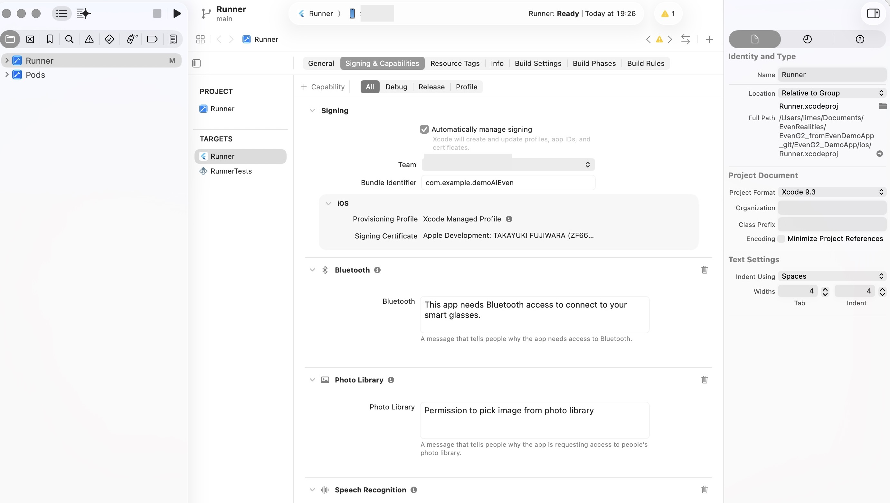
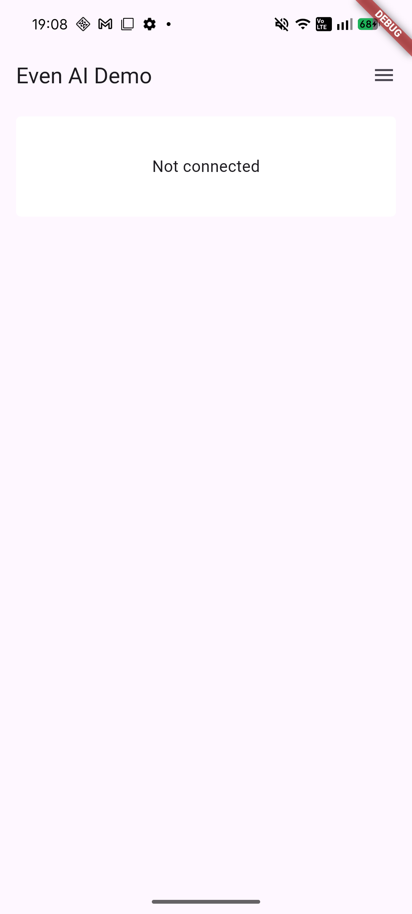
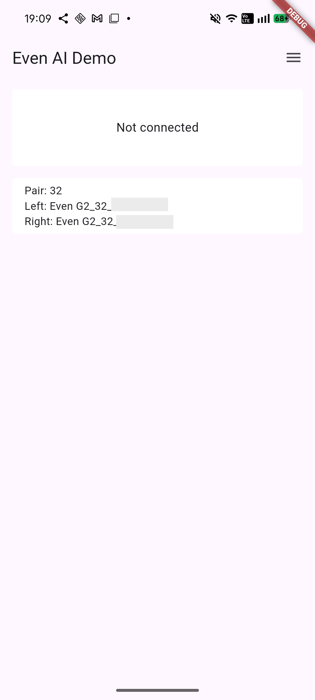
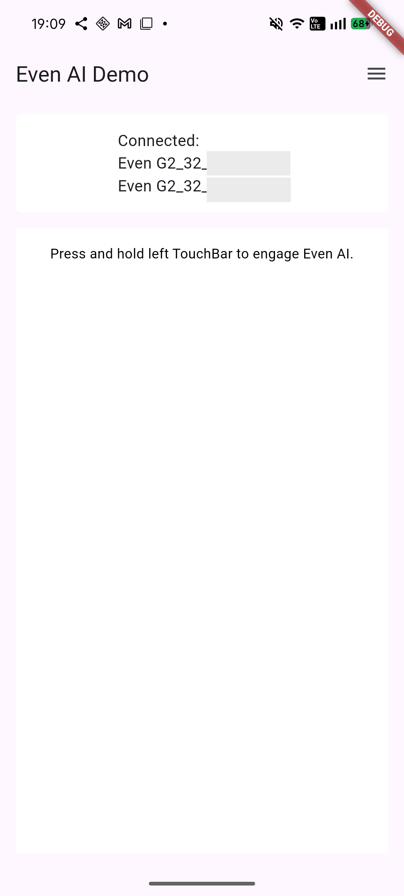
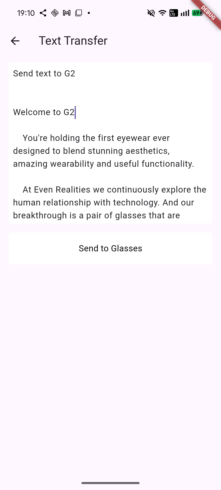
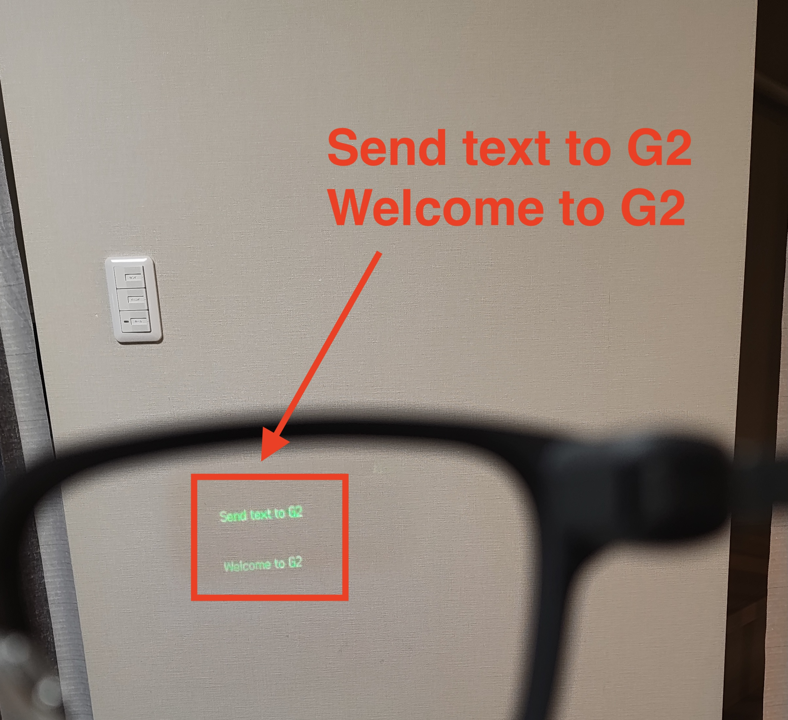

# Even Demo for G2

The repository has been forked from [EvenDemoApp](https://github.com/even-realities/EvenDemoApp) and modified by GitHub Copilot.  


# How to build

## Make Flutter environment

See [Flutter install section in "Flutter Docs"](https://docs.flutter.dev/install)  

If you have already installed Flutter environment in your computer, you can skip the process.

## Solve dependency

```bash
$ pwd
-> top directory
$ flutter pub get
```
If you want to build ios app, these command below may be useful.  


## Build  

When you plug your ios or Android devices in your computer, it's Ok to run the command on top directory. 

Flutter recognizes plugged devices and build for the devices automatically.

### Build Android devices

Plug your android smartphone and run the command below.

```bash
$ pwd //top directory
$ flutter run
```

### Build iOS devices

Open your Xcode project (ios/Runner.xcodeproj).  

Modify "Signing and Capabilities".  Replace initial idenfitier name with your organization name.  




```bash
$ cd ios
$ flutter precache --ios  
$ pod install 
$ cd ../  //top directory
$ flutter run
```

* Known Issues  

Your app is installed on your iPhone but pairing with G2 is failed. It will be modified.

# Run with your G2

Before running your original app, terminate official Even app and confirm BLE connection between official app and G2.  

With confirming your G2 is close to your smartphone, run your own app and tap "Not Connected" area.  




Your app automatically detect a pair of G2 glasses.  



Touch your glass name. BLE connection will be done after a few seconds. 



# Send Text to G2

When you tap three stacked horizontal lines, you can see three features as "BMP", "Notification", and "Text".
Touch "Text", then you can see the message on your G2.




Here is an example that G2 shows part of received text.




You can scroll down all of messages that G2 received.

# Next Plan (TBD)

- Send BMP to G2  
- Make my own AI agent  

# UnConfirmed

# Reference: G2 Protocol Implementation

以降の文書はGitHub Copilotで生成されました。  

[Even Reailities G1向けリポジトリ](https://github.com/even-realities/EvenDemoApp)をもとに変更した点をまとめています。  


## 主な変更点

### 1. BLE UUID の更新
- G1: `6E400001-B5A3-F393-E0A9-E50E24DCCA9E`
- G2: `00002760-08c2-11e1-9073-0e8ac72e0000`

### 2. 新しいプロトコルファイル

#### `lib/services/g2_protocol.dart`
G2プロトコルの実装:
- CRC-16/CCITT 計算
- Varintエンコーディング
- パケット構築（認証、ディスプレイ設定、テキスト送信）
- テキストフォーマット（25文字/行、10行/ページ）

#### `lib/services/g2_text_service.dart`
G2テキスト転送サービス:
- 7パケット認証シーケンス
- テレプロンプタープロトコル実装
- 両眼への同期送信

### 3. Text Transfer の使用方法

```dart
import 'package:demo_ai_even/services/g2_text_service.dart';

// テキストを送信
final success = await G2TextService.instance.sendText("Your text here");
```

既存の `TextService.startSendText()` は自動的にG2プロトコルを使用します。

### 4. プロトコルシーケンス

1. **認証** (7パケット) - セッション確立
2. **ディスプレイ設定** (0x0E-20, type=2) - ディスプレイパラメータ設定
3. **テレプロンプター初期化** (0x06-20, type=1) - スクリプト選択、モード設定
4. **コンテンツページ 0-9** (0x06-20, type=3) - 最初のバッチ
5. **ミッドストリームマーカー** (0x06-20, type=255) - 必須マーカー
6. **コンテンツページ 10-11** (0x06-20, type=3) - 2番目のバッチ
7. **同期トリガー** (0x80-00, type=14) - レンダリングトリガー
8. **コンテンツページ 12+** (0x06-20, type=3) - 残りのページ

### 5. テキストフォーマット仕様

- **25文字/行**: 行の最大幅
- **10行/ページ**: 各ページの行数
- **約7行表示**: 一度に表示される行数
- **最小14ページ**: 正しくレンダリングするための最小コンテンツ
- **自動改行**: 単語境界で改行
- **明示的な改行**: `\n` でサポート

### 6. G2デバイス命名規則

- 左: `Even G2_XX_L_YYYYYY`
- 右: `Even G2_XX_R_YYYYYY`

ここで:
- `XX` = モデルバリアント
- `L/R` = 左/右耳
- `YYYYYY` = シリアル接尾辞

## デバッグ

ログを確認するには:
```
flutter run --verbose
```

G2TextServiceは各ステップで詳細なログを出力します:
- `G2TextService: Authenticating...`
- `G2TextService: Formatting text...`
- `G2TextService: Sending display config...`
- `G2TextService: Initializing teleprompter...`
- 等々

## 参考文献

このG2プロトコル実装は以下に基づいています:
https://github.com/i-soxi/even-g2-protocol

## トラブルシューティング

### テキストが表示されない場合

1. デバイスがG2（G1ではない）であることを確認
2. 両眼が接続されていることを確認
3. 認証が成功しているか確認（ログを確認）
4. テキストが最低140行（14ページ）にパディングされていることを確認

### 接続の問題

1. Bluetoothがオンになっていることを確認
2. グラスが充電されていることを確認
3. 他のアプリ（公式Evenアプリなど）がグラスに接続していないことを確認
4. アプリを再起動して認証状態をリセット
